# SDLC Delivery Process

Issue #1031 consolidates the delivery process into one diagram. The process is
defined across `AGENTS.md`, `.claude/roles/worker.md`,
`.claude/skills/wav-run-sprint/SKILL.md`, and `.github/workflows/ci.yml`; this
page is a view of those files, not a second source of truth. When they change,
change this page.

## The whole process

```mermaid
flowchart TD
    subgraph intake["Intake — AGENTS.md § Workflow"]
        direction TB
        DISC["Discussion · debugging<br/>review · planning<br/><i>no issue required</i>"]
        NEW["/wav-create-issue<br/>one type label · 2+ acceptance criteria"]
        READY(["status:ready"])
        NEW --> READY
    end

    READY --> FORK{"How is it picked up?"}

    subgraph interactive["Interactive path — a human is present"]
        direction TB
        START["pnpm wivwav start N<br/>status:in-progress · branch from origin/main"]
        IWORK["Implement with the requester<br/>read narrow ranges · commit per layer"]
        INOREV["<b>No reviewer subagent runs</b><br/>review is whatever the human asks for"]
        START --> IWORK --> INOREV
    end

    subgraph sprint["Sprint path — unattended"]
        direction TB
        TRIG["Trigger: cron weekdays 09:00 UTC<br/>workflow_dispatch · repository_dispatch"]
        CLI["pnpm wivwav run-sprint<br/><i>owns</i> selection · labels · branch · worktree<br/>.agents/ context · /tmp/wivwav-N.md recovery"]
        WORKER["Worker (sonnet, in worktree)<br/>verify pwd · branch · merge-base<br/>plan → implement → commit per layer<br/>push → draft PR"]
        REV["<b>Foreground multi-role reviewer</b><br/>reviewer + qa always<br/>+ accessibility → apps/web<br/>+ performance → api·scraper·db·queue·search<br/>+ docs-accuracy → routes·markdown"]
        VERD{"REVISION_NEEDED?"}
        FIXES["Apply <i>all</i> findings<br/>critical · warning · suggestion"]
        TRIG --> CLI --> WORKER --> REV --> VERD
        VERD -->|yes| FIXES --> REV
    end

    FORK -->|"human picks one issue"| START
    FORK -->|"CLI claims ready issues"| TRIG

    INOREV --> CHECKS
    VERD -->|no| CHECKS

    subgraph finishgate["Shared finish gate — /wav-finish-issue"]
        direction TB
        CHECKS["pnpm typecheck && lint && build && test<br/><i>never commit after a failed check</i>"]
        COMMIT["Commit · push<br/>closing keyword in the PR <b>body</b>"]
        DRAFT["Draft PR · status:needs-review"]
        CHECKS --> COMMIT --> DRAFT
    end

    DRAFT --> HUMAN{"Human review<br/>mark PR ready"}
    HUMAN -->|changes requested| HANDOFF
    HANDOFF --> IWORK
    HUMAN -->|approved| MERGE["gh pr merge N --auto<br/><i>no --rebase · no --delete-branch</i>"]

    subgraph queue["Merge queue — rebase method"]
        direction TB
        MQ["Queue rebases onto main"]
        MGCI["ci.yml on merge_group<br/><b>e2e + restore-drill run here</b><br/>(skipped on the PR itself)"]
        PUB["Publish digest-pinned images"]
        MQ --> MGCI --> PUB
    end

    STUCK["status:stuck<br/>comment reason · do not repair<br/>orchestration state by hand"]
    HANDOFF["<b>Becomes interactive work</b><br/>a sprint worker has already exited and<br/>run-sprint removed its worktree, so the<br/>sprint path cannot receive the change back"]

    MERGE --> MQ
    PUB --> MAIN(["main"])
    MGCI -.->|fails| STUCK
    WORKER -.->|worktree·branch·base mismatch| STUCK

    DISC -.->|"becomes implementation work"| NEW

    classDef gap fill:#7f1d1d,stroke:#ef4444,color:#fff
    classDef strong fill:#14532d,stroke:#22c55e,color:#fff
    class INOREV gap
    class REV strong
    classDef handoff fill:#78350f,stroke:#f59e0b,color:#fff
    class HANDOFF handoff
```

## The two paths are not equivalent

The diagram's one genuinely non-obvious fact: **the same change gets more review
through the sprint path than through the interactive path.**

| | Interactive path | Sprint path |
| --- | --- | --- |
| Branch and worktree | You create the branch | `run-sprint` owns both; the worker must never create either |
| Reviewer subagent | **None by default** | Mandatory, foreground, multi-role |
| Roles applied | Whatever is asked for | `reviewer` + `qa`, plus `accessibility` / `performance` / `docs-accuracy` by area |
| Findings | Human's discretion | All findings applied, including warnings and suggestions |
| Finish gate | Identical | Identical |
| Merge path | Identical | Identical |

Two consequences worth holding onto:

- A change delivered interactively reaches the same merge queue with strictly
  less review. Closing that gap on the interactive path is the subject of #467.
- Sprint workers run in worktrees, and a worktree checkout does not include
  `.claude/settings.local.json`. A language server enabled at `local` scope
  therefore does not load for them, so the sprint-path reviewer works without
  the type diagnostics an interactive session has. See
  [Code Intelligence](code-intelligence.md); scope decision tracked in #1030.

## Where each stage is defined

| Stage in the diagram | Source of truth |
| --- | --- |
| Issue required before implementation; never implement on `main` | `AGENTS.md` § Workflow |
| Issue shape, labels, acceptance criteria | `.claude/skills/wav-create-issue/SKILL.md` |
| What `run-sprint` owns; sequential vs `--parallel` | `.claude/skills/wav-run-sprint/SKILL.md` |
| Worker's 15 steps; `status:stuck` on mismatch | `.claude/roles/worker.md` |
| Reviewer contract; `REVISION_NEEDED` | `.claude/roles/reviewer.md`, `qa.md`, `accessibility.md`, `performance.md`, `docs-accuracy.md` |
| Finish gate commands; draft PR; `status:needs-review` | `.claude/skills/wav-finish-issue/SKILL.md`, `AGENTS.md` § Definition of done |
| Sprint triggers and cron | `.github/workflows/run-sprint.yml` |
| Which CI jobs run on PR vs `merge_group` | `.github/workflows/ci.yml`, `docs/design/merge-queue.md` |
| Merge command constraints | `AGENTS.md` § Workflow |

## Reading the diagram

- **Red node** — the review gap on the interactive path.
- **Green node** — the mandatory review gate on the sprint path.
- **Dotted edges** — failure and escalation transitions, not the happy path.
- `e2e` and `restore-drill` are deliberately placed after the merge queue
  admits the PR: `ci.yml` gates them on `github.event_name == 'merge_group'` (or
  a push to `main`), so they do not run on the pull request itself.
